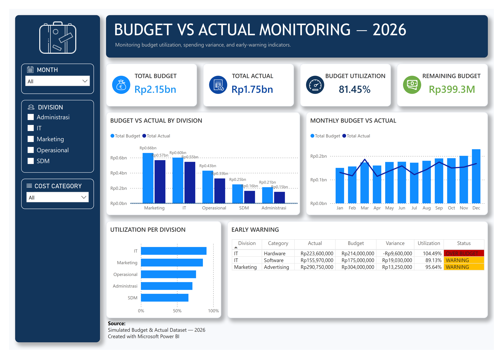

# 📊 Budget vs Actual Monitoring Dashboard — 2026

> **An Interactive Financial Monitoring & Early-Warning Dashboard built with Microsoft Excel, Power Query, DAX, and Power BI.**


---

[🖼️ Preview](#-dashboard-preview) • [📌 Overview](#-project-overview--business-problem) • [🔄 Workflow](#-project-workflow--methodology) • [📐 Data Model](#-data-architecture-star-schema) • [🧠 DAX Measures](#-key-dax-measures) • [📈 Insights](#-key-insights--results) • [📁 Structure](#-repository-structure)

## 🖼️ Dashboard Preview



---

## 📌 Project Overview & Business Problem

Operational budget tracking in many organizations relies heavily on static, manual spreadsheet updates. This manual approach makes it difficult for management to track actual spending against approved budgets, identify departments approaching spending limits, and detect over-budget conditions before they occur.

This project develops an automated **Budget vs Actual Monitoring Dashboard** analyzing **1,500+ operational transactions** across **5 key divisions** (*Marketing, IT & Sistem, Operasional, SDM & HRD, Administrasi*) for FY 2026.

### 🚦 Automated Early-Warning Threshold Logic:
| Utilization (%) | Status | Indicator | Management Action Required |
| :---: | :---: | :---: | :--- |
| `< 85%` | **NORMAL** | 🟢 Green | Spending on track; no intervention needed. |
| `85% – <100%` | **WARNING** | 🟡 Yellow | Approaching limit; requires active monitoring. |
| `≥ 100%` | **OVER BUDGET** | 🔴 Red | Exceeded budget limit; immediate control required. |
| `0 Actuals` | **NO TRANSACTION** | ⚪ Gray | Budget allocated, zero actual transactions logged. |

---

## 🔄 Project Workflow & Methodology

```text
┌─────────────────────────┐     ┌─────────────────────────┐     ┌─────────────────────────┐     ┌─────────────────────────┐
│  1. Data Prep (Excel)   │ ──► │  2. ETL (Power Query)   │ ──► │  3. Data Modeling (PBI) │ ──► │  4. DAX & Visuals (PBI) │
│ Clean raw transactions  │     │ Transform & standardize │     │ Build Star Schema model │     │ Measures & Early Warning│
└─────────────────────────┘     └─────────────────────────┘     └─────────────────────────┘     └─────────────────────────┘
```

1. **Data Cleaning & Validation (Excel & Power Query):** Standardized transaction dates, trimmed extra text whitespace, removed duplicates, and validated data types for 1,500+ operational records.
2. **Data Modeling (Power BI):** Constructed a clean Star Schema model linking factual transaction logs (`FactActual`, `FactBudget`) to shared dimension tables (`DimMonth`, `DimDivision`, `DimCategory`).
3. **DAX Formulation:** Written measures for *Total Budget*, *Total Actual*, *Variance*, *Utilization %*, and automated *Budget Status* classification using `SWITCH(TRUE(), ...)`.
4. **Dashboard Development:** Built an interactive dashboard featuring executive KPI cards, monthly trends, divisional utilization comparisons, and an automated Early Warning attention table.

---

## 📐 Data Architecture (Star Schema)

The Power BI model separates numerical transaction facts from descriptive analytical dimensions:

```text
       ┌──────────────┐
       │   DimMonth   │
       └──────┬───────┘
              │
┌─────────────┼──────────────┐
│             ▼              │
│      ┌──────────────┐      │
├─────►│  FactActual  │◄─────┤
│      └──────────────┘      │
│                            │
│      ┌──────────────┐      │
├─────►│  FactBudget  │◄─────┤
│      └──────────────┘      │
│             ▲              │
│             │              │
┌─────────────┴──────────────┐
│  DimDivision │ DimCategory │
└──────────────┴─────────────┘
```

---

## 🧠 Key DAX Measures

### 1. Budget Utilization Rate (%)
```dax
Utilization % = 
DIVIDE(
    [Total Actual], 
    [Total Budget], 
    0
)
```

### 2. Automated Budget Status Classification
```dax
Budget Status = 
VAR ActualCount = [Actual Transaction Count]
VAR Utilization = [Utilization %]
RETURN
SWITCH(
    TRUE(),
    ActualCount = 0, "NO TRANSACTION",
    Utilization >= 1.00, "OVER BUDGET",
    Utilization >= 0.85, "WARNING",
    "NORMAL"
)
```

### 3. Early Warning Visual Filter
```dax
Early Warning Flag = 
VAR CurrentStatus = [Budget Status]
RETURN
IF(
    CurrentStatus = "WARNING" || CurrentStatus = "OVER BUDGET", 
    1, 
    0
)
```

---

## 📈 Key Insights & Results

- **Overall Budget Performance:** **81.45%** of the approved **Rp 2.15 Billion** operational budget has been consumed (**Rp 1.75 Billion** actual spending), leaving **Rp 399.3 Million** in remaining budget reserves.
- **Divisional Breakdown:**
  - 🟡 **IT & Sistem (90.70%)** & **Marketing (85.69%)** reached **WARNING** status and require budget reallocation control.
  - 🟢 **Operasional (76.20%)**, **Administrasi (71.19%)**, and **SDM & HRD (65.69%)** remain comfortably within safe limits.
- **Business Impact:** Replaced repetitive manual reporting with an automated early-warning monitoring layer, providing instant visibility into department spending risks and budget variance.

---

## 📁 Repository Structure

```text
Budget-Vs-Actual-Dashboard/
├── data/
│   └── Budget_vs_Actual_2026_Dataset.xlsx
├── powerbi/
│   └── Budget_vs_Actual_2026.pbix
├── Dashboard.png
├── README.md
```

---

## 👤 Author & Disclaimer

- **Author:** **Muhammad Arifin Fadhil Nugroho** — *Financial Data Analysis & Power BI Portfolio*
- **Disclaimer:** This project is built for portfolio demonstration purposes using a simulated FY 2026 operational dataset.
